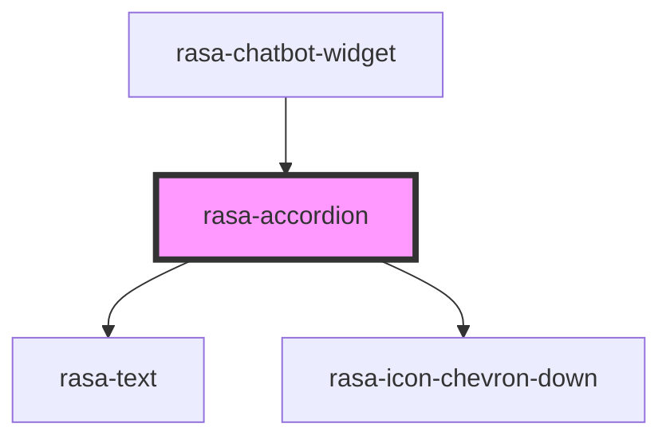

# rasa-accordion

<!-- Auto Generated Below -->

## Properties

| Property | Attribute | Description                                                                                                      | Type     | Default     |
| -------- | --------- | ---------------------------------------------------------------------------------------------------------------- | -------- | ----------- |
| `label`  | `label`   | Represents the label property of an Accordion component. The label serves as the title or heading for accordion. | `string` | `undefined` |

## Dependencies

### Used by

 - [rasa-chatbot-widget](../../rasa-chatbot-widget)

### Depends on

- [rasa-text](../text)
- rasa-icon-chevron-down

### Graph

----------------------------------------------

*Built with [StencilJS](https://stenciljs.com/)*
