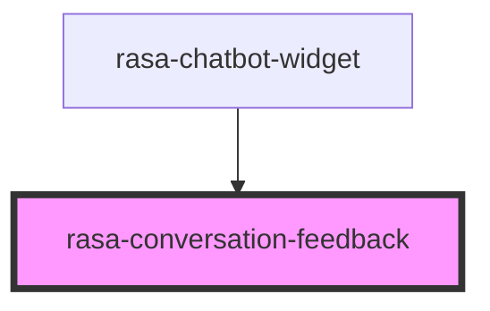

# rasa-conversation-feedback

<!-- Auto Generated Below -->

## Properties

| Property       | Attribute        | Description                                                                   | Type      | Default |
| -------------- | ---------------- | ----------------------------------------------------------------------------- | --------- | ------- |
| `questionText` | `question-text`  | Text for the feedback question. If empty, component will not be shown.        | `string`  | `''`    |
| `show`         | `show`           | Whether the feedback component should be shown                                | `boolean` | `false` |
| `submitted`    | `submitted`      | Whether the feedback has been submitted                                       | `boolean` | `false` |
| `thankYouText` | `thank-you-text` | Text for the thank you message. If empty, no thank you message will be shown. | `string`  | `''`    |

## Events

| Event               | Description                              | Type                                                                   |
| ------------------- | ---------------------------------------- | ---------------------------------------------------------------------- |
| `feedbackSubmitted` | Event emitted when feedback is submitted | `CustomEvent<{ rating: "positive" \| "negative"; helpful: boolean; }>` |

## Dependencies

### Used by

 - [rasa-chatbot-widget](../../rasa-chatbot-widget)

### Graph

----------------------------------------------

*Built with [StencilJS](https://stenciljs.com/)*
