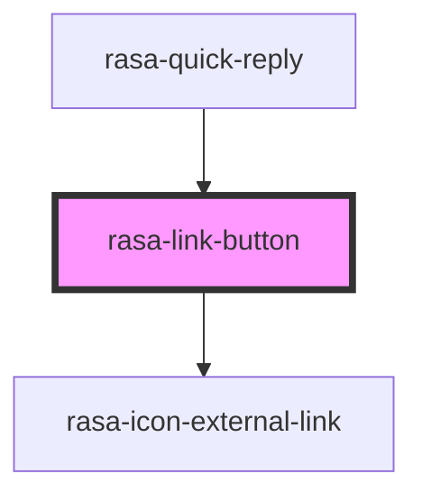

# rasa-link-button

<!-- Auto Generated Below -->

## Properties

| Property     | Attribute     | Description                    | Type      | Default     |
| ------------ | ------------- | ------------------------------ | --------- | ----------- |
| `isSelected` | `is-selected` | Is button selected as option   | `boolean` | `false`     |
| `link`       | `link`        | Href value for the link button | `string`  | `undefined` |

## Dependencies

### Used by

 - [rasa-quick-reply](../quick-reply)

### Depends on

- rasa-icon-external-link

### Graph

----------------------------------------------

*Built with [StencilJS](https://stenciljs.com/)*
