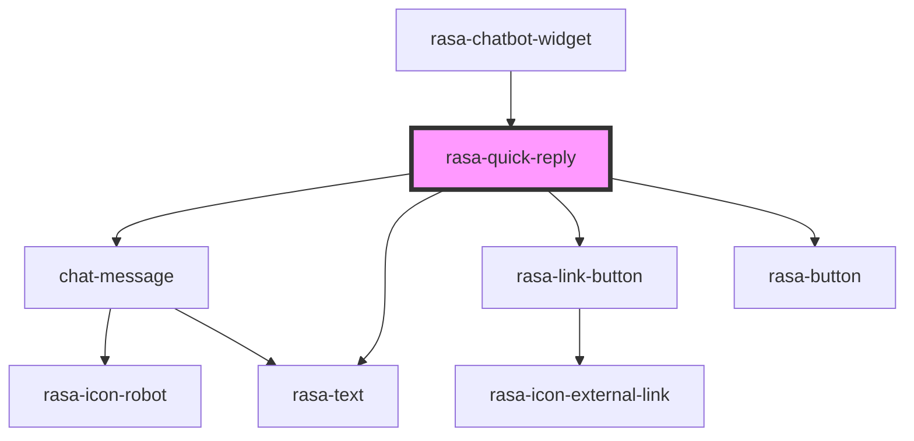

# rasa-quick-reply

<!-- Auto Generated Below -->

## Properties

| Property       | Attribute        | Description             | Type                | Default     |
| -------------- | ---------------- | ----------------------- | ------------------- | ----------- |
| `elementKey`   | `element-key`    | Element key             | `number`            | `undefined` |
| `isHistory`    | `is-history`     | Is message form history | `boolean`           | `false`     |
| `message`      | --               | Message value           | `QuickReplyMessage` | `undefined` |
| `quickReplyId` | `quick-reply-id` | Element unique id       | `string`            | `undefined` |

## Events

| Event                | Description          | Type                                                    |
| -------------------- | -------------------- | ------------------------------------------------------- |
| `quickReplySelected` | Quick reply selected | `CustomEvent<{ quickReply: QuickReply; key: number; }>` |

## Dependencies

### Used by

 - [rasa-chatbot-widget](../../rasa-chatbot-widget)

### Depends on

- [chat-message](../message)
- [rasa-text](../text)
- [rasa-link-button](../link-button)
- [rasa-button](../button)

### Graph

----------------------------------------------

*Built with [StencilJS](https://stenciljs.com/)*
