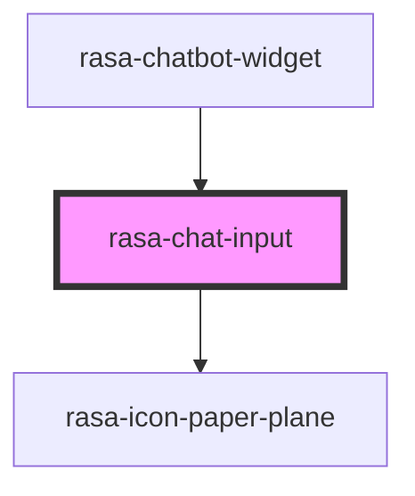

# rasa-chat-input

<!-- Auto Generated Below -->

## Properties

| Property       | Attribute       | Description | Type     | Default |
| -------------- | --------------- | ----------- | -------- | ------- |
| `initialValue` | `initial-value` | Input value | `string` | `''`    |

## Events

| Event                | Description        | Type                  |
| -------------------- | ------------------ | --------------------- |
| `sendMessageHandler` | Send message event | `CustomEvent<string>` |

## Dependencies

### Used by

 - [rasa-chatbot-widget](../../rasa-chatbot-widget)

### Depends on

- rasa-icon-paper-plane

### Graph

----------------------------------------------

*Built with [StencilJS](https://stenciljs.com/)*
