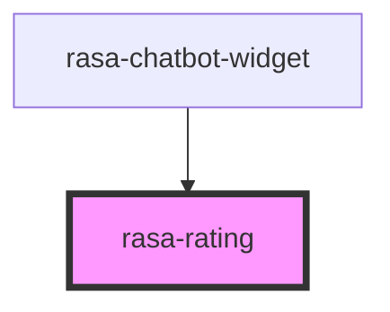

# rasa-rating

<!-- Auto Generated Below -->

## Properties

| Property  | Attribute | Description                                                 | Type                                              | Default                          |
| --------- | --------- | ----------------------------------------------------------- | ------------------------------------------------- | -------------------------------- |
| `message` | `message` | Customizable message from Rasa (Previously thankYouMessage) | `string`                                          | `"Thank you for your feedback!"` |
| `options` | `options` | List of rating options from Rasa                            | `string \| { value: string; payload: string; }[]` | `[]`                             |
| `text`    | `text`    | Instructional text for the rating component                 | `string`                                          | `undefined`                      |

## Events

| Event            | Description                             | Type                                               |
| ---------------- | --------------------------------------- | -------------------------------------------------- |
| `ratingSelected` | Event emitted when a rating is selected | `CustomEvent<{ value: string; payload: string; }>` |

## Dependencies

### Used by

 - [rasa-chatbot-widget](../../rasa-chatbot-widget)

### Graph

----------------------------------------------

*Built with [StencilJS](https://stenciljs.com/)*
