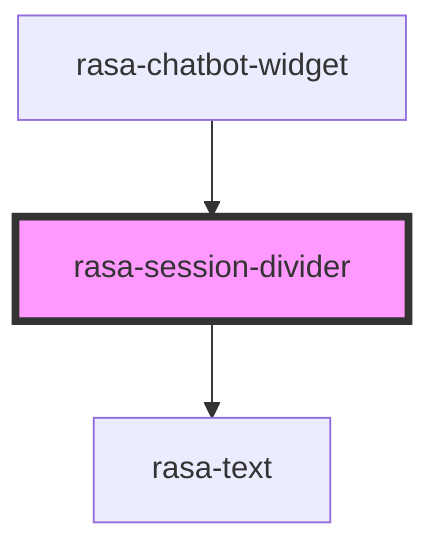

# rasa-session-divider

<!-- Auto Generated Below -->

## Properties

| Property             | Attribute              | Description                                   | Type     | Default                |
| -------------------- | ---------------------- | --------------------------------------------- | -------- | ---------------------- |
| `sessionStartDate`   | --                     | Session start datetime                        | `Date`   | `undefined`            |
| `sessionStartedText` | `session-started-text` | Text to display before the session start date | `string` | `'Session started on'` |

## Dependencies

### Used by

 - [rasa-chatbot-widget](../../rasa-chatbot-widget)

### Depends on

- [rasa-text](../text)

### Graph

----------------------------------------------

*Built with [StencilJS](https://stenciljs.com/)*
