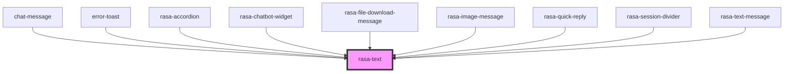

# rasa-text

<!-- Auto Generated Below -->

## Properties

| Property                  | Attribute                   | Description                                                       | Type      | Default     |
| ------------------------- | --------------------------- | ----------------------------------------------------------------- | --------- | ----------- |
| `disableParsing`          | `disable-parsing`           | Disables text parsing (renders text as is, not markdown)          | `boolean` | `false`     |
| `enableStream`            | `enable-stream`             | Disables text stream rendering                                    | `boolean` | `false`     |
| `notifyCompleteRendering` | `notify-complete-rendering` | Should component notify messageQueueService at complete rendering | `boolean` | `false`     |
| `value`                   | `value`                     | Text value                                                        | `string`  | `undefined` |

## Events

| Event                | Description                | Type                            |
| -------------------- | -------------------------- | ------------------------------- |
| `linkClicked`        | User clicked on link       | `CustomEvent<undefined>`        |
| `textStreamComplete` | Trigger on stream complete | `CustomEvent<{ value: true; }>` |

## Dependencies

### Used by

 - [chat-message](../message)
 - [error-toast](../error-toast)
 - [rasa-accordion](../accordion)
 - [rasa-chatbot-widget](../../rasa-chatbot-widget)
 - [rasa-file-download-message](../file-download-message)
 - [rasa-image-message](../image-message)
 - [rasa-quick-reply](../quick-reply)
 - [rasa-session-divider](../session-devider)
 - [rasa-text-message](../text-message)

### Graph

----------------------------------------------

*Built with [StencilJS](https://stenciljs.com/)*
