# rasa-chatbot-widget

<!-- Auto Generated Below -->

## Properties

| Property                  | Attribute                   | Description                                                                                                                                    | Type      | Default                    |
| ------------------------- | --------------------------- | ---------------------------------------------------------------------------------------------------------------------------------------------- | --------- | -------------------------- |
| `authenticationToken`     | `authentication-token`      | User authentication token                                                                                                                      | `string`  | `''`                       |
| `autoOpen`                | `auto-open`                 | If set to True, it will open the chat, triggering the 'initialPayload' immediately if set.                                                     | `boolean` | `false`                    |
| `botIcon`                 | `bot-icon`                  | Static icon for the chatbot                                                                                                                    | `string`  | `''`                       |
| `displayTimestamp`        | `display-timestamp`         | Indicates if a message timestamp should be displayed                                                                                           | `boolean` | `false`                    |
| `enableFeedback`          | `enable-feedback`           | If set to True, shows conversation feedback component at the bottom of the chat.                                                               | `boolean` | `false`                    |
| `errorMessage`            | `error-message`             | Message that should be displayed if an error occurs                                                                                            | `string`  | `'Something bad happened'` |
| `feedbackQuestionText`    | `feedback-question-text`    | Text for the feedback question. If empty, feedback component will not be shown.                                                                | `string`  | `''`                       |
| `feedbackThankYouText`    | `feedback-thank-you-text`   | Text for the thank you message after feedback submission. If empty, no thank you message will be shown.                                        | `string`  | `''`                       |
| `feedbackTriggerPattern`  | `feedback-trigger-pattern`  | Rasa flow pattern to trigger feedback. When this pattern is completed, feedback will be shown. Example: "pattern_completed" or "utter_goodbye" | `string`  | `''`                       |
| `fontFamily`              | `font-family`               | Font family to use for the widget. Defaults to 'Lato, sans-serif'                                                                              | `string`  | `'Lato, sans-serif'`       |
| `initialPayload`          | `initial-payload`           | Data that should be sent on Chat Widget initialization                                                                                         | `string`  | `''`                       |
| `inputMessagePlaceholder` | `input-message-placeholder` | Message placeholder for input                                                                                                                  | `string`  | `'Type your message here'` |
| `messageDelay`            | `message-delay`             | Indicates time between message is received and printed.                                                                                        | `number`  | `600`                      |
| `messageTimestamp`        | `message-timestamp`         | Format of the message timestamp                                                                                                                | `string`  | `''`                       |
| `restEnabled`             | `rest-enabled`              | If set to True, instead of the default WebSocket communication, the widget will use the HTTP protocol.                                         | `boolean` | `false`                    |
| `senderId`                | `sender-id`                 | ID of a user engaged with the Chat Widget                                                                                                      | `string`  | `''`                       |
| `serverUrl` _(required)_  | `server-url`                | Url of the Rasa chatbot backend server (example: https://example.com)                                                                          | `string`  | `undefined`                |
| `sessionStartedText`      | `session-started-text`      | Text to display before the session start date in session divider                                                                               | `string`  | `'Session started on'`     |
| `streamMessages`          | `stream-messages`           | If set to True, bot messages will be received as stream (printing word by word).                                                               | `boolean` | `false`                    |
| `toggleFullScreen`        | `toggle-full-screen`        | Indicates whether the chat messenger can be toggled to full screen mode.                                                                       | `boolean` | `false`                    |
| `widgetIcon`              | `widget-icon`               | Static icon for the widget                                                                                                                     | `string`  | `''`                       |
| `widgetTitle`             | `widget-title`              | Title of the Chat Widget                                                                                                                       | `string`  | `'Rasa Widget'`            |

## Events

| Event                           | Description                                         | Type                                                                   |
| ------------------------------- | --------------------------------------------------- | ---------------------------------------------------------------------- |
| `chatSessionStarted`            | Emitted when the Chat Widget is opened by the user  | `CustomEvent<{ sessionId: string; }>`                                  |
| `chatWidgetClosed`              | Emitted when the Chat Widget is closed by the user  | `CustomEvent<undefined>`                                               |
| `chatWidgetFeedbackSubmitted`   | Emitted when conversation feedback is submitted.    | `CustomEvent<{ rating: "positive" \| "negative"; helpful: boolean; }>` |
| `chatWidgetFileStartedDownload` | Emitted when a user is starting to download a file. | `CustomEvent<undefined>`                                               |
| `chatWidgetHyperlinkClicked`    | Emitted when a user clicks on a hyperlink option.   | `CustomEvent<undefined>`                                               |
| `chatWidgetOpened`              | Emitted when the Chat Widget is opened by the user  | `CustomEvent<undefined>`                                               |
| `chatWidgetQuickReply`          | Emitted when the user click on quick reply          | `CustomEvent<string>`                                                  |
| `chatWidgetReceivedMessage`     | Emitted when the user receives a message            | `CustomEvent<unknown>`                                                 |
| `chatWidgetSentMessage`         | Emitted when the user sends a message               | `CustomEvent<string>`                                                  |

## Dependencies

### Depends on

- [rasa-session-divider](../components/session-devider)
- [chat-message](../components/message)
- [rasa-text-message](../components/text-message)
- [rasa-image-message](../components/image-message)
- [rasa-video](../components/video)
- [rasa-file-download-message](../components/file-download-message)
- [rasa-accordion](../components/accordion)
- [rasa-text](../components/text)
- [rasa-quick-reply](../components/quick-reply)
- [rasa-carousel](../components/carousel)
- [rasa-rating](../components/rating)
- [global-error-handler](../components/error-handler)
- [rasa-typing-indicator](../components/typing-indicator)
- [rasa-conversation-feedback](../components/conversation-feedback)
- rasa-icon-close-chat
- rasa-icon-chat
- [error-toast](../components/error-toast)
- [rasa-chat-input](../components/rasa-chat-input)

### Graph

```mermaid
graph TD;
  rasa-chatbot-widget --> rasa-session-divider
  rasa-chatbot-widget --> chat-message
  rasa-chatbot-widget --> rasa-text-message
  rasa-chatbot-widget --> rasa-image-message
  rasa-chatbot-widget --> rasa-video
  rasa-chatbot-widget --> rasa-file-download-message
  rasa-chatbot-widget --> rasa-accordion
  rasa-chatbot-widget --> rasa-text
  rasa-chatbot-widget --> rasa-quick-reply
  rasa-chatbot-widget --> rasa-carousel
  rasa-chatbot-widget --> rasa-rating
  rasa-chatbot-widget --> global-error-handler
  rasa-chatbot-widget --> rasa-typing-indicator
  rasa-chatbot-widget --> rasa-conversation-feedback
  rasa-chatbot-widget --> rasa-icon-close-chat
  rasa-chatbot-widget --> rasa-icon-chat
  rasa-chatbot-widget --> error-toast
  rasa-chatbot-widget --> rasa-chat-input
  rasa-session-divider --> rasa-text
  chat-message --> rasa-icon-robot
  chat-message --> rasa-text
  rasa-text-message --> rasa-text
  rasa-image-message --> rasa-image
  rasa-image-message --> rasa-text
  rasa-image --> rasa-icon-default-image-fallback
  rasa-file-download-message --> rasa-icon-paperclip
  rasa-file-download-message --> rasa-text
  rasa-accordion --> rasa-text
  rasa-accordion --> rasa-icon-chevron-down
  rasa-quick-reply --> chat-message
  rasa-quick-reply --> rasa-text
  rasa-quick-reply --> rasa-link-button
  rasa-quick-reply --> rasa-button
  rasa-link-button --> rasa-icon-external-link
  rasa-carousel --> rasa-image-message
  rasa-carousel --> rasa-icon-chevron-down
  rasa-typing-indicator --> chat-message
  error-toast --> rasa-icon-danger
  error-toast --> rasa-text
  rasa-chat-input --> rasa-icon-paper-plane
  style rasa-chatbot-widget fill:#f9f,stroke:#333,stroke-width:4px
```

----------------------------------------------

*Built with [StencilJS](https://stenciljs.com/)*
