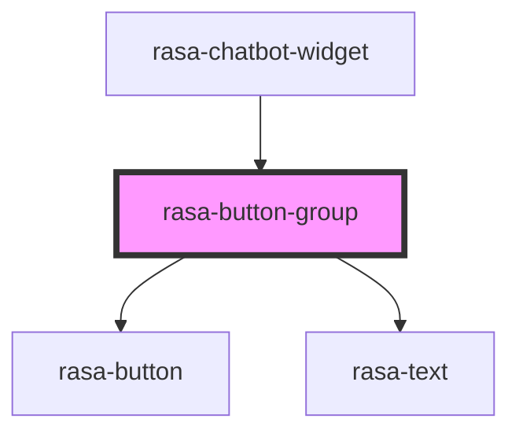

# rasa-button-group

<!-- Auto Generated Below -->

## Properties

| Property  | Attribute | Description         | Type                         | Default     |
| --------- | --------- | ------------------- | ---------------------------- | ----------- |
| `buttons` | --        | Buttons list        | `QuickReply[]`               | `undefined` |
| `type`    | `type`    | Type of button list | `"buttons" \| "quick-reply"` | `undefined` |

## Dependencies

### Used by

 - [rasa-chatbot-widget](../../rasa-chatbot-widget)

### Depends on

- [rasa-button](../button)
- [rasa-text](../text)

### Graph

----------------------------------------------

*Built with [StencilJS](https://stenciljs.com/)*
