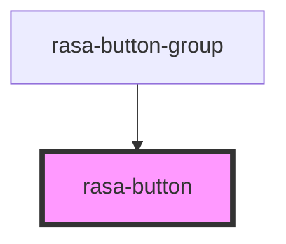

# rasa-button

<!-- Auto Generated Below -->

## Properties

| Property     | Attribute     | Description                                     | Type      | Default     |
| ------------ | ------------- | ----------------------------------------------- | --------- | ----------- |
| `isSelected` | `is-selected` | Is button selected as option                    | `boolean` | `false`     |
| `reply`      | `reply`       | Additional value that is passed at button click | `string`  | `undefined` |

## Events

| Event                | Description                   | Type                               |
| -------------------- | ----------------------------- | ---------------------------------- |
| `buttonClickHandler` | On button click event emitter | `CustomEvent<{ value?: string; }>` |

## Dependencies

### Used by

 - [rasa-button-group](../button-group)

### Graph

----------------------------------------------

*Built with [StencilJS](https://stenciljs.com/)*
