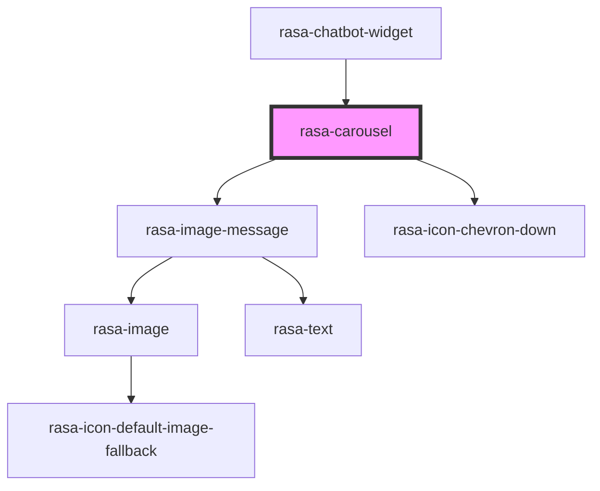

# rasa-carousel

<!-- Auto Generated Below -->

## Properties

| Property   | Attribute | Description               | Type                | Default     |
| ---------- | --------- | ------------------------- | ------------------- | ----------- |
| `elements` | --        | List of carousel elements | `CarouselElement[]` | `undefined` |

## Dependencies

### Used by

 - [rasa-chatbot-widget](../../rasa-chatbot-widget)

### Depends on

- [rasa-image-message](../image-message)
- rasa-icon-chevron-down

### Graph

----------------------------------------------

*Built with [StencilJS](https://stenciljs.com/)*
