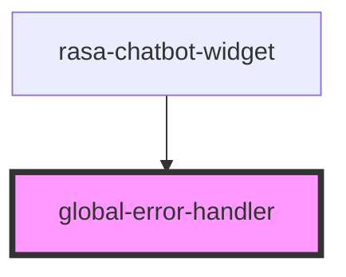

# error-handler

<!-- Auto Generated Below -->

## Dependencies

### Used by

 - [rasa-chatbot-widget](../../rasa-chatbot-widget)

### Graph

----------------------------------------------

*Built with [StencilJS](https://stenciljs.com/)*
