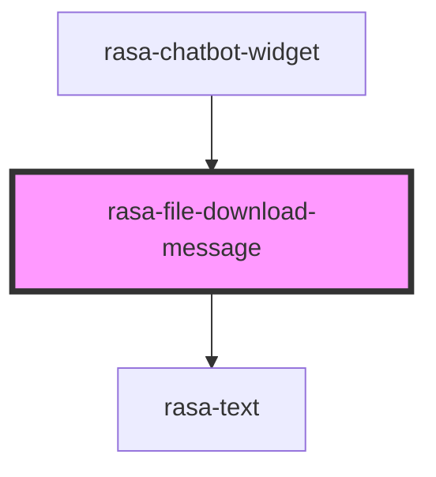

# rasa-file-download-message

<!-- Auto Generated Below -->

## Properties

| Property   | Attribute   | Description                           | Type     | Default     |
| ---------- | ----------- | ------------------------------------- | -------- | ----------- |
| `fileName` | `file-name` | The file name for the downloaded file | `string` | `undefined` |
| `fileUrl`  | `file-url`  | URL of the file to download           | `string` | `undefined` |
| `text`     | `text`      | Message text                          | `string` | `undefined` |

## Dependencies

### Used by

 - [rasa-chatbot-widget](../../rasa-chatbot-widget)

### Depends on

- [rasa-text](../text)

### Graph

----------------------------------------------

*Built with [StencilJS](https://stenciljs.com/)*
