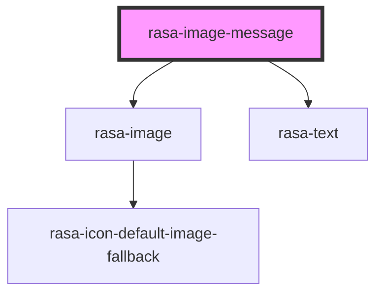

# rasa-image-message

<!-- Auto Generated Below -->

## Properties

| Property   | Attribute   | Description            | Type     | Default     |
| ---------- | ----------- | ---------------------- | -------- | ----------- |
| `imageAlt` | `image-alt` | Alt text for the image | `string` | `''`        |
| `imageSrc` | `image-src` | Image source           | `string` | `undefined` |
| `text`     | `text`      | Message text           | `string` | `undefined` |

## Dependencies

### Depends on

- [rasa-image](../image)
- [rasa-text](../text)

### Graph

----------------------------------------------

*Built with [StencilJS](https://stenciljs.com/)*
