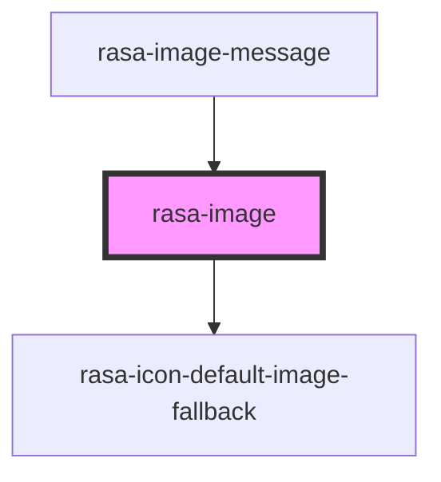

# rasa-image

<!-- Auto Generated Below -->

## Properties

| Property | Attribute | Description            | Type     | Default     |
| -------- | --------- | ---------------------- | -------- | ----------- |
| `alt`    | `alt`     | Alt text for the image | `string` | `''`        |
| `height` | `height`  | Image height           | `string` | `undefined` |
| `src`    | `src`     | Image source           | `string` | `undefined` |
| `width`  | `width`   | Image width            | `string` | `undefined` |

## Dependencies

### Used by

 - [rasa-image-message](../image-message)

### Depends on

- rasa-icon-default-image-fallback

### Graph

----------------------------------------------

*Built with [StencilJS](https://stenciljs.com/)*
