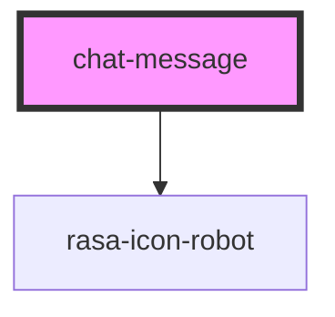

# chat-message

<!-- Auto Generated Below -->

## Properties

| Property         | Attribute          | Description          | Type              | Default     |
| ---------------- | ------------------ | -------------------- | ----------------- | ----------- |
| `hideSenderIcon` | `hide-sender-icon` | Show sender icon     | `boolean`         | `false`     |
| `sender`         | `sender`           | Who sent the message | `"bot" \| "user"` | `undefined` |

## Shadow Parts

| Part               | Description |
| ------------------ | ----------- |
| `"messagecontent"` |             |

## Dependencies

### Depends on

- rasa-icon-robot

### Graph

----------------------------------------------

*Built with [StencilJS](https://stenciljs.com/)*
