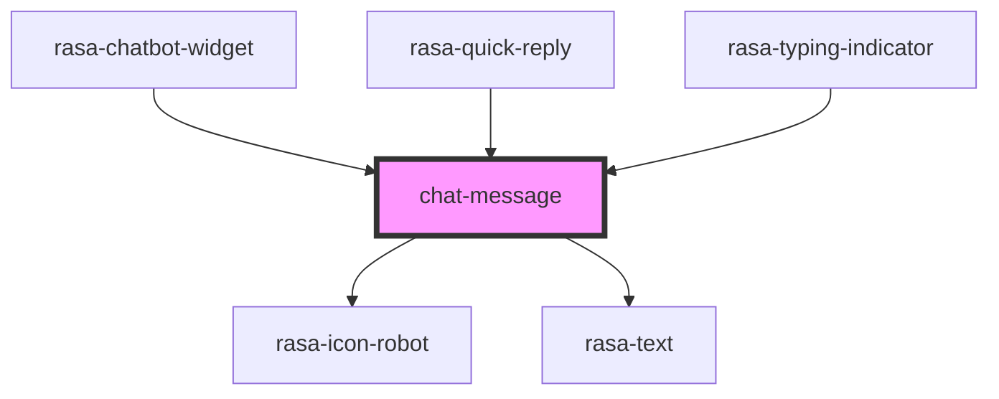

# chat-message

<!-- Auto Generated Below -->

## Properties

| Property         | Attribute          | Description            | Type              | Default     |
| ---------------- | ------------------ | ---------------------- | ----------------- | ----------- |
| `hideSenderIcon` | `hide-sender-icon` | Show sender icon       | `boolean`         | `false`     |
| `sender`         | `sender`           | Who sent the message   | `"bot" \| "user"` | `undefined` |
| `showTimestamp`  | `show-timestamp`   | Show message timestamp | `boolean`         | `undefined` |
| `timestamp`      | --                 | Message timestamp      | `Date`            | `undefined` |

## Shadow Parts

| Part               | Description |
| ------------------ | ----------- |
| `"messagecontent"` |             |

## Dependencies

### Used by

 - [rasa-chatbot-widget](../../rasa-chatbot-widget)
 - [rasa-quick-reply](../quick-reply)
 - [rasa-typing-indicator](../typing-indicator)

### Depends on

- rasa-icon-robot
- [rasa-text](../text)

### Graph

----------------------------------------------

*Built with [StencilJS](https://stenciljs.com/)*
