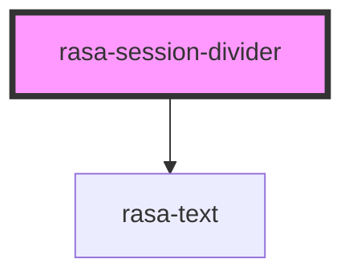

# rasa-session-divider

<!-- Auto Generated Below -->

## Properties

| Property           | Attribute | Description            | Type   | Default     |
| ------------------ | --------- | ---------------------- | ------ | ----------- |
| `sessionStartDate` | --        | Session start datetime | `Date` | `undefined` |

## Dependencies

### Depends on

- [rasa-text](../text)

### Graph

----------------------------------------------

*Built with [StencilJS](https://stenciljs.com/)*
