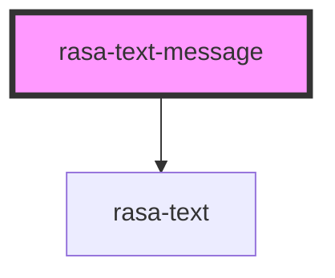

# rasa-text-message

<!-- Auto Generated Below -->

## Properties

| Property | Attribute | Description          | Type              | Default     |
| -------- | --------- | -------------------- | ----------------- | ----------- |
| `sender` | `sender`  | Who sent the message | `"bot" \| "user"` | `undefined` |
| `value`  | `value`   | Message value        | `string`          | `undefined` |

## Dependencies

### Depends on

- [rasa-text](../text)

### Graph

----------------------------------------------

*Built with [StencilJS](https://stenciljs.com/)*
