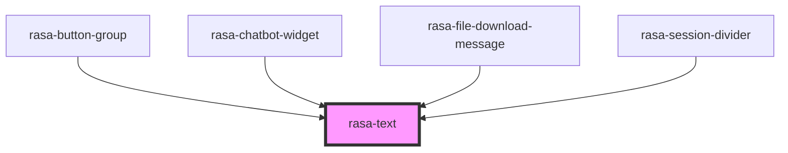

# rasa-text

<!-- Auto Generated Below -->

## Properties

| Property | Attribute | Description             | Type     | Default     |
| -------- | --------- | ----------------------- | -------- | ----------- |
| `value`  | `value`   | Button click event name | `string` | `undefined` |

## Dependencies

### Used by

 - [rasa-button-group](../button-group)
 - [rasa-chatbot-widget](../../rasa-chatbot-widget)
 - [rasa-file-download-message](../file-download-message)
 - [rasa-session-divider](../session-devider)

### Graph

----------------------------------------------

*Built with [StencilJS](https://stenciljs.com/)*
