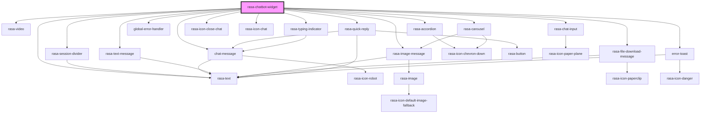

# rasa-chatbot-widget

<!-- Auto Generated Below -->

## Properties

| Property                  | Attribute                   | Description                                                                                            | Type      | Default                                                  |
| ------------------------- | --------------------------- | ------------------------------------------------------------------------------------------------------ | --------- | -------------------------------------------------------- |
| `authorizationToken`      | `authorization-token`       | User authorization token                                                                               | `string`  | `WIDGET_DEFAULT_CONFIGURATION.AUTHORIZATION_TOKEN`       |
| `autoOpen`                | `auto-open`                 | If set to True, it will open the chat, triggering the 'initialPayload' immediately if set.             | `boolean` | `WIDGET_DEFAULT_CONFIGURATION.AUTO_OPEN`                 |
| `botIcon`                 | `bot-icon`                  | Static icon for the chatbot                                                                            | `string`  | `WIDGET_DEFAULT_CONFIGURATION.BOT_ICON`                  |
| `displayTimestamp`        | `display-timestamp`         | Indicates if a message timestamp should be displayed                                                   | `boolean` | `WIDGET_DEFAULT_CONFIGURATION.DISPLAY_TIMESTAMP`         |
| `errorMessage`            | `error-message`             | Message that should be displayed if an error occurs                                                    | `string`  | `WIDGET_DEFAULT_CONFIGURATION.ERROR_MESSAGE`             |
| `initialPayload`          | `initial-payload`           | Data that should be sent on Chat Widget initialization                                                 | `string`  | `WIDGET_DEFAULT_CONFIGURATION.INITIAL_PAYLOAD`           |
| `inputMessagePlaceholder` | `input-message-placeholder` | Message placeholder for input                                                                          | `string`  | `WIDGET_DEFAULT_CONFIGURATION.INPUT_MESSAGE_PLACEHOLDER` |
| `messageDelay`            | `message-delay`             | Indicates time between message is received and printed.                                                | `number`  | `WIDGET_DEFAULT_CONFIGURATION.MESSAGE_DELAY`             |
| `messageTimestamp`        | `message-timestamp`         | Format of the message timestamp                                                                        | `string`  | `WIDGET_DEFAULT_CONFIGURATION.MESSAGE_TIMESTAMP`         |
| `restEnabled`             | `rest-enabled`              | If set to True, instead of the default WebSocket communication, the widget will use the HTTP protocol. | `boolean` | `WIDGET_DEFAULT_CONFIGURATION.REST_ENABLED`              |
| `senderId`                | `sender-id`                 | ID of a user engaged with the Chat Widget                                                              | `string`  | `WIDGET_DEFAULT_CONFIGURATION.SENDER_ID`                 |
| `serverUrl`               | `server-url`                | Url of the Rasa chatbot backend server                                                                 | `string`  | `WIDGET_DEFAULT_CONFIGURATION.SERVER_URL`                |
| `streamMessages`          | `stream-messages`           | If set to True, bot messages will be received as stream (printing word by word).                       | `boolean` | `WIDGET_DEFAULT_CONFIGURATION.STREAM_MESSAGES`           |
| `toggleFullScreen`        | `toggle-full-screen`        | Indicates whether the chat messenger can be toggled to full screen mode.                               | `boolean` | `WIDGET_DEFAULT_CONFIGURATION.TOGGLE_FULLSCREEN`         |
| `widgetIcon`              | `widget-icon`               | Static icon for the widget                                                                             | `string`  | `WIDGET_DEFAULT_CONFIGURATION.WIDGET_ICON`               |
| `widgetTitle`             | `widget-title`              | Title of the Chat Widget                                                                               | `string`  | `WIDGET_DEFAULT_CONFIGURATION.WIDGET_TITLE`              |

## Events

| Event                       | Description                                        | Type                     |
| --------------------------- | -------------------------------------------------- | ------------------------ |
| `chatWidgetClosed`          | Emitted when the Chat Widget is closed by the user | `CustomEvent<undefined>` |
| `chatWidgetOpened`          | Emitted when the Chat Widget is opened by the user | `CustomEvent<undefined>` |
| `chatWidgetQuickReply`      | Emitted when the user click on quick reply         | `CustomEvent<string>`    |
| `chatWidgetReceivedMessage` | Emitted when the user receives a message           | `CustomEvent<unknown>`   |
| `chatWidgetSentMessage`     | Emitted when the user sends a message              | `CustomEvent<string>`    |

## Dependencies

### Depends on

- [rasa-session-divider](../components/session-devider)
- [chat-message](../components/message)
- [rasa-text-message](../components/text-message)
- [rasa-image-message](../components/image-message)
- [rasa-video](../components/video)
- [rasa-file-download-message](../components/file-download-message)
- [rasa-accordion](../components/accordion)
- [rasa-text](../components/text)
- [rasa-quick-reply](../components/quick-reply)
- [rasa-carousel](../components/carousel)
- [global-error-handler](../components/error-handler)
- [rasa-typing-indicator](../components/typing-indicator)
- rasa-icon-close-chat
- rasa-icon-chat
- [error-toast](../components/error-toast)
- [rasa-chat-input](../components/rasa-chat-input)

### Graph

----------------------------------------------

*Built with [StencilJS](https://stenciljs.com/)*
