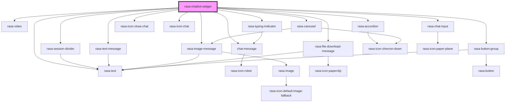

# rasa-chatbot-widget

<!-- Auto Generated Below -->

## Properties

| Property           | Attribute            | Description                                                                                            | Type      | Default     |
| ------------------ | -------------------- | ------------------------------------------------------------------------------------------------------ | --------- | ----------- |
| `autoOpen`         | `auto-open`          | If set to True, it will open the chat, triggering the 'initialPayload' immediately if set.             | `boolean` | `false`     |
| `messageDelay`     | `message-delay`      | Indicates time between message is received and printed.                                                | `number`  | `100`       |
| `restEnabled`      | `rest-enabled`       | If set to True, instead of the default WebSocket communication, the widget will use the HTTP protocol. | `boolean` | `false`     |
| `serverUrl`        | `server-url`         | Url of the Rasa chatbot backend server                                                                 | `string`  | `undefined` |
| `streamMessages`   | `stream-messages`    | If set to True, bot messages will be received as stream (printing word by word).                       | `boolean` | `false`     |
| `toggleFullScreen` | `toggle-full-screen` | Indicates whether the chat messenger can be toggled to full screen mode.                               | `boolean` | `false`     |

## Events

| Event                       | Description                              | Type                   |
| --------------------------- | ---------------------------------------- | ---------------------- |
| `chatWidgetReceivedMessage` | Emitted when the user receives a message | `CustomEvent<unknown>` |
| `chatWidgetSentMessage`     | Emitted when the user sends a message    | `CustomEvent<string>`  |

## Dependencies

### Depends on

- [rasa-session-divider](../components/session-devider)
- [chat-message](../components/message)
- [rasa-text-message](../components/text-message)
- [rasa-image-message](../components/image-message)
- [rasa-video](../components/video)
- [rasa-file-download-message](../components/file-download-message)
- [rasa-accordion](../components/accordion)
- [rasa-text](../components/text)
- [rasa-button-group](../components/button-group)
- [rasa-carousel](../components/carousel)
- [rasa-typing-indicator](../components/typing-indicator)
- rasa-icon-close-chat
- rasa-icon-chat
- [rasa-chat-input](../components/rasa-chat-input)

### Graph

----------------------------------------------

*Built with [StencilJS](https://stenciljs.com/)*
