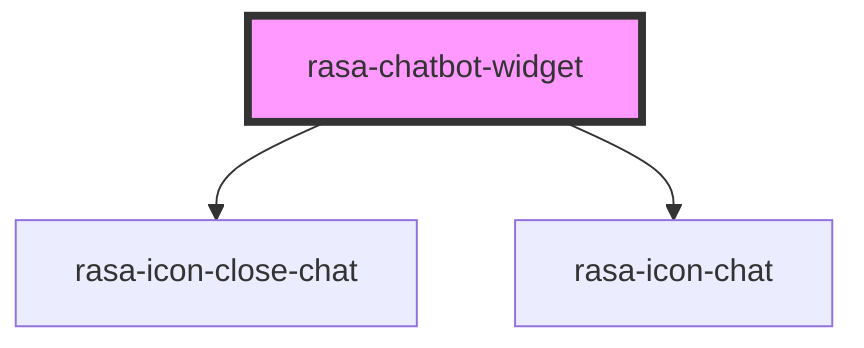

# rasa-chatbot-widget

<!-- Auto Generated Below -->

## Properties

| Property           | Attribute            | Description                                                              | Type      | Default |
| ------------------ | -------------------- | ------------------------------------------------------------------------ | --------- | ------- |
| `toggleFullScreen` | `toggle-full-screen` | Indicates whether the chat messenger can be toggled to full screen mode. | `boolean` | `false` |

## Dependencies

### Depends on

- rasa-icon-close-chat
- rasa-icon-chat

### Graph

----------------------------------------------

*Built with [StencilJS](https://stenciljs.com/)*
